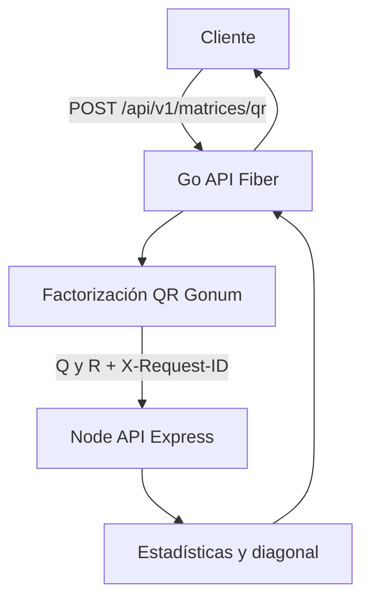

# Coding Challenge — Matrix QR Microservices

Dos APIs REST independientes que se comunican por HTTP. Go recibe una matriz, calcula su factorización QR y orquesta a Node para obtener estadísticas sobre las matrices Q y R.

## Descripción

El cliente habla únicamente con la API Go. Node es un servicio interno de cálculo. La solución es stateless, sin base de datos, y está preparada para ejecutarse con Docker Compose en un servidor Linux.

## Requerimientos del challenge

- Una API en **Go** con **Fiber**
- Una API en **Node.js** con **Express**
- Comunicación **HTTP** entre ambas
- Contenerización con **Docker** y **Compose**
- Preparación para despliegue en **cloud** (pendiente de URL)

## Arquitectura



Dentro de Docker, Go llama a `http://node-api:3000`. En local, a `http://localhost:3000`.

## Flujo de procesamiento

1. El cliente envía `{ "matrix": [...] }` a Go.
2. Go valida forma, valores finitos y `m >= n`.
3. Go factoriza con `gonum.org/v1/gonum/mat`.
4. Obtiene Q (m×m) y R (m×n).
5. POST a Node `/api/v1/statistics` con `{ "matrices": { "q", "r" } }` y el mismo `X-Request-ID`.
6. Node calcula max, min, average y sum sobre **todos** los valores de Q y R.
7. Node indica si Q, R o alguna es diagonal (epsilon).
8. Go consolida originalMatrix, factorization, statistics y diagonal.
9. El cliente recibe el envelope con `meta.requestId`.

## Tecnologías

**Go API:** Go 1.24, Fiber v2, Gonum `mat.QR`, `net/http`

**Node API:** Node.js >= 20, Express 5, Joi, Pino

**Infrastructure:** Docker multi-stage (Go), `node:20-bookworm-slim`, Compose

**Testing:** Jest + Supertest; `testing` + `httptest` en Go

## Estructura del proyecto

```text
coding-challenge/
├── go-api/
│   ├── cmd/api/main.go
│   ├── docs/                 OpenAPI + Swagger UI
│   ├── internal/matrix/
│   ├── internal/statistics/
│   └── Dockerfile
├── node-api/
│   ├── src/
│   ├── docs/openapi.yaml
│   └── Dockerfile
├── docker-compose.yml
├── docs/
├── .env.example
└── README.md
```

## API Go

| Método | Ruta | Descripción |
| --- | --- | --- |
| GET | `/health` | Liveness. No llama a Node. |
| GET | `/docs` | Swagger UI |
| GET | `/openapi.yaml` | Especificación OpenAPI |
| POST | `/api/v1/matrices/qr` | QR + estadísticas |

## API Node

| Método | Ruta | Descripción |
| --- | --- | --- |
| GET | `/health` | Liveness |
| GET | `/docs` | Swagger UI |
| POST | `/api/v1/statistics` | Estadísticas de Q y R |

## Ejemplo de uso

Con ambas APIs en local:

```bash
curl -s -X POST http://localhost:8080/api/v1/matrices/qr \
  -H "Content-Type: application/json" \
  -H "X-Request-ID: challenge-test-001" \
  -d '{"matrix":[[12,-51,4],[6,167,-68],[-4,24,-41]]}'
```

Respuesta (forma real): `success`, `data.originalMatrix`, `data.factorization.q/r`, `data.statistics`, `data.diagonal`, `meta.requestId`. Los números de `statistics` salen de Q∪R, no de la matriz original.

## Ejecución local

Sin Docker. Node en el puerto 3000 y Go en el 8080.

```bash
cd node-api
cp .env.example .env
npm ci
npm start
```

```bash
cd go-api
cp .env.example .env
go mod download
go run ./cmd/api
```

`STATISTICS_API_URL` en local debe ser `http://localhost:3000`.

## Ejecución con Docker

Requiere Docker Engine y el plugin Compose en el entorno de ejecución. **Esta máquina de desarrollo no tiene Docker**; los contenedores se validan en un servidor Linux.

```bash
cp .env.example .env
docker compose up -d --build
docker compose ps
docker compose logs -f
docker compose down
```

- Go en el host: `http://localhost:8080`
- Node en el host: `http://localhost:3000` (útil para pruebas; en producción podría quedar interno)
- Entre contenedores: `STATISTICS_API_URL=http://node-api:3000`

## Variables de entorno

| Variable | Servicio | Descripción | Default |
| --- | --- | --- | --- |
| `PORT` | Go | Puerto HTTP | `8080` |
| `PORT` | Node | Puerto HTTP | `3000` |
| `APP_ENV` | ambas | `development`, `test` o `production` | `development` |
| `NODE_ENV` | Node / Compose | Entorno Node | `production` en Compose |
| `LOG_LEVEL` | Node | Nivel de Pino | `info` |
| `MAX_MATRIX_DIM` | ambas | Máximo de filas/columnas | `200` |
| `JSON_BODY_LIMIT` | Node | Límite de body | `1mb` |
| `DIAGONAL_EPSILON` | Node | Tolerancia para diagonal | `1e-10` |
| `STATISTICS_API_URL` | Go | Base URL de Node, **sin** path `/api` | local `http://localhost:3000`; Docker `http://node-api:3000` |
| `STATISTICS_API_TIMEOUT` | Go | Timeout del client HTTP | `5s` |
| `GO_PORT` / `NODE_PORT` | Compose | Puertos publicados en el host | `8080` / `3000` |

No hay secretos ni credenciales en este challenge.

## Tests

```bash
cd node-api && npm test
cd go-api && go test ./...
```

Los tests de Go no levantan Node: usan stubs y `httptest.Server`.

## Documentación Swagger

- Go: [http://localhost:8080/docs](http://localhost:8080/docs)
- Node: [http://localhost:3000/docs](http://localhost:3000/docs)

Especificaciones: `go-api/docs/openapi.yaml`, `node-api/docs/openapi.yaml`.

## Manejo de errores

- Validación de matriz: 400 (`MATRIX_REQUIRED`, `EMPTY_MATRIX`, `IRREGULAR_MATRIX`, …)
- QR no aplicable (`m < n`): 422 `UNSUPPORTED_MATRIX_DIMENSIONS`
- Node caído: 503 `STATISTICS_SERVICE_UNAVAILABLE`
- Timeout: 504 `STATISTICS_SERVICE_TIMEOUT`
- Respuesta inválida o 4xx/5xx de Node: 502
- Node propio: `VALIDATION_ERROR` 400, `NOT_FOUND` 404, `INTERNAL_ERROR` 500

## Trazabilidad

Cabecera `X-Request-ID`. Si el cliente no la envía, Go genera un UUID y lo reutiliza hacia Node y en `meta.requestId`. Node la refleja en la respuesta y, en errores, en `error.requestId`.

## Decisiones técnicas

### QR vs rotación

El enunciado nombra rotación de matrices en arquitectura y factorización QR en funcionalidad requerida. **QR es el requisito principal** porque está explícito en la funcionalidad. La rotación queda como mejora futura. No se implementó un endpoint de rotación.

### Ausencia de base de datos

El flujo es de cálculo en memoria. Sequelize, GORM o PostgreSQL añadirían persistencia que el challenge no pide.

### Comunicación HTTP

Go es el orquestador público. Node no conoce al cliente ni a QR. Así se cumplen dos stacks independientes y un único contrato de entrada.

### Gonum

`mat.QR` implementa Householder. Exige **m ≥ n**. Q es m×m y R es m×n. No se reimplementó Gram-Schmidt.

### Arquitectura modular

Node: route → validator → controller → service → funciones puras.  
Go: Fiber → handler → validator → service → `qr.go` → HTTP client.

### Floating point

QR y estadísticas se serializan en float64 sin redondeo. La diagonalidad usa `DIAGONAL_EPSILON` (`1e-10`). Los tests de QR comparan `A ≈ Q·R` y `QᵀQ ≈ I` con tolerancia `1e-10`.

### Timeout

La llamada a Node usa `http.Client` con `STATISTICS_API_TIMEOUT` (5s) para no bloquear el orquestador.

Detalle adicional: [docs/decisions.md](docs/decisions.md). Arquitectura: [docs/architecture.md](docs/architecture.md).

## Consideraciones de producción

No implementado: HTTPS, autenticación, rate limiting, métricas/tracing y gestión de secretos. Son mejoras posteriores.

## Cloud deployment

Status: **Pending deployment.**

## Mejoras futuras

- Endpoint de rotación de matrices
- JWT
- Frontend
- Persistencia opcional
- CI/CD
- Dejar Node solo en la red interna de Compose
